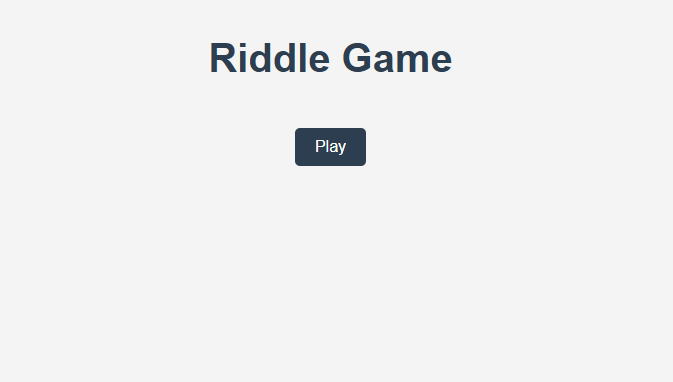
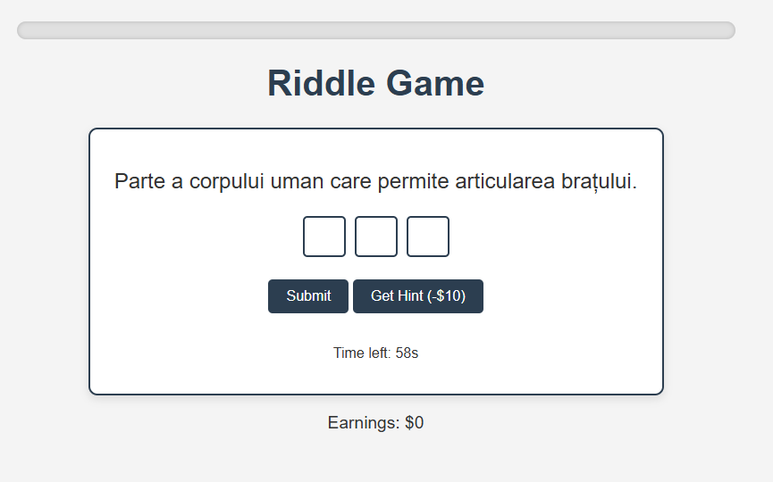
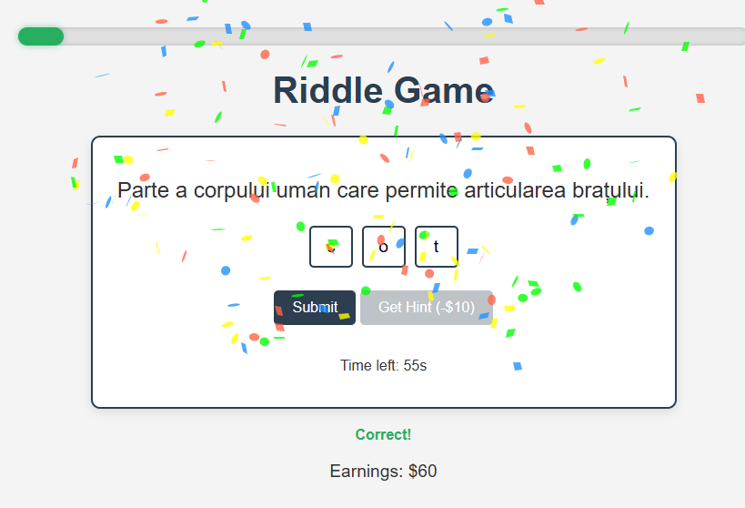

# **Riddle Game**

A fun, interactive web-based **Riddle Game** where players solve riddles, earn virtual dollars, and progress through increasingly challenging riddles! Built using **HTML**, **CSS**, **JavaScript**, and a **FastAPI** backend with an **SQLite** database for storing riddles.

---

## **Features**

- 🎮 **Game Mechanics**:
  - Players solve riddles in order of increasing answer length (from 3 to 10 characters).
  - Two riddles are presented for each answer length.
  - Earn **$10** per character for each correct answer.
  - A hint system deducts **$10** and reveals a random character.
  - Automatic timer of **60 seconds** for each riddle, after which the game moves to the next riddle.

- 📊 **Progress Tracking**:
  - A dynamic progress bar shows how far the player has advanced.
  - A smooth animated dollar counter updates earnings in real-time.
  
- 🎉 **Visual & Interactive Enhancements**:
  - Confetti celebration for correct answers.
  - Animated input boxes (bounce for correct answers, shake for wrong answers).
  - Sound effects for correct answers, wrong answers, timeouts, and button clicks.
  
---

## **Tech Stack**

- **Frontend**:  
  - HTML, CSS, JavaScript
- **Backend**:  
  - FastAPI, SQLite
- **Libraries**:  
  - [`canvas-confetti`](https://www.npmjs.com/package/canvas-confetti) for confetti effects

---

## **Setup Instructions**

1. **Clone the repository**:
   ```bash
   git clone https://github.com/your-username/riddle-game.git
   cd riddle-game```
2. **Start the backend**:
   Make sure you have Python installed, then run:
   ```bash
   uvicorn main:app --reload```
   The FastAPI backend will start on `http://127.0.0.1:8000`.

3. **Open the game in your browser**:
   Simply open `index.html` in any modern web browser.

---

## **Game Flow**

1. Press the **"Play"** button to start.
2. Solve each riddle by typing the answer into the input boxes.
3. Submit your answer using the **"Submit"** button or by pressing **Enter**.
4. Use the **"Get Hint"** button if you need help (costs $10).
5. Complete all riddles from 3 to 10 characters and view your final earnings.

---

## **Screenshots**

#### **Main Screen**


#### **Riddle in Progress**


#### **Correct Answer**


---

## **Future Enhancements**

- Difficulty levels (Easy, Medium, Hard) with different time limits and hint costs.
- Bonus rounds for extra earnings after completing the main game.
- Multiplayer mode for real-time riddle-solving competition.
- Leaderboard to track the highest scores locally.

---

## **Contributing**

Contributions are welcome! If you have ideas for new features or improvements, feel free to open an issue or submit a pull request.


